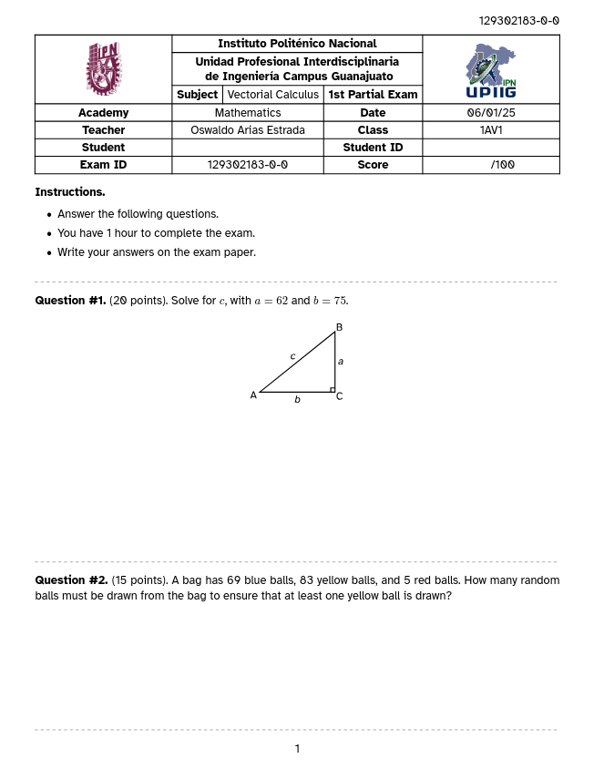

# QG-Typst
Quiz Generator in Typst. Create multiple quiz versions from the same template.

| Questionarie | Solutions |
|--------------|-----------|
|  |  |

## Information


Modify the `questionarie` object with your own data.

```typst
show: questionarie.with(
    teacher: "Oswaldo Arias Estrada",
    title: "1st Partial Exam",
    subject: "Vectorial Calculus",
    school: "Instituto Politénico Nacional",
    faculty: "Unidad Profesional Interdisciplinaria \n de Ingeniería Campus Guanajuato",
    academy: "Mathematics",
    class: "1AV1",
    date: "06/01/25",
    paper: "us-letter",
    textFont: "Atkinson Hyperlegible",
    codeFont: "Roboto Mono",
    schoolLogo: "images/IPN.png",
    schoolLogoWidth: 30%,
    facultyLogo: "images/UPIIG.png",
    facultyLogoWidth: 40%,
    instructions: [
      - Answer the following questions.

      - You have 1 hour to complete the exam.

      - Write your answers on the exam paper.
    ],

    ...
  )
```

## Versions

The `Exam ID` is generated using the `seed`, the `examVersions`, and the number of student. It appears in the `information` section and in the header of each page. The first part of the `Exam ID` is the `seed`, the second part is the version and the third part is the student number.


Modify the `seed`, `students`, `examVersions`, and `answers` variables with your own data.

```typst
#let seed = 129302183

#let students = 12
#let examVersions = 4
#let answers = true
```

## Questions

Modify the `questions` object with your own. The `questions` object is a tuple with the path to the questions files.

```typst
#let questions = (
  "questions/hypotenuse of a right triangle.typ",
  "questions/balls.typ",
  "questions/derivative.typ",
  "questions/cars speeds.typ",
  "questions/polygons.typ"
)
```

## Question File

### Question


The `question` function is a tuple with the seed to generate the random numbers to use in the question. It also has the question text.

```typst
#let question(seed) = {
  let rng = gen-rng(seed)
  let blue = 0
  let yellow = 0
  let red = 0
  let color = 0
  let colorName = ""
  let numberOfBalls = 0

  (rng, blue) = integers(rng, low: 20, high: 100)
  (rng, yellow) = integers(rng, low: 30, high: 100)
  (rng, red) = integers(rng, low: 1, high: 50)

  let balls = (
    blue: blue,
    yellow: yellow,
    red: red,
  )

  (rng, color) = integers(rng, low: 1, high: 3, endpoint: true)

  if color == 1 {
    colorName = "blue"
    numberOfBalls = yellow + red + 1
  } else if color == 2 {
    colorName = "yellow"
    numberOfBalls = blue + red + 1
  } else {
    colorName = "red"
    numberOfBalls = blue + yellow + 1
  }

  [A bag has #balls.blue blue balls, #balls.yellow yellow balls, and #balls.red red balls. How many random balls must be drawn from the bag to ensure that at least one #colorName ball is drawn?]
}
```

### Points and Size

The `questionPoints` and `answerSize` variables are used to set the points for each question and the size of the answer space.

```typst
#let questionPoints = 15
#let answerSize = 8
```

### Answer


The `answer` function is a tuple with the seed to generate the random numbers to use in the answer. It also has the answer text.

```typst
#let answer(seed) = {
  let rng = gen-rng(seed)
  let blue = 0
  let yellow = 0
  let red = 0
  let color = 0
  let colorName = ""
  let numberOfBalls = 0

  (rng, blue) = integers(rng, low: 20, high: 100)
  (rng, yellow) = integers(rng, low: 30, high: 100)
  (rng, red) = integers(rng, low: 1, high: 50)

  let balls = (
    blue: blue,
    yellow: yellow,
    red: red,
  )

  (rng, color) = integers(rng, low: 1, high: 3, endpoint: true)

  if color == 1 {
    colorName = "blue"
    numberOfBalls = yellow + red + 1
  } else if color == 2 {
    colorName = "yellow"
    numberOfBalls = blue + red + 1
  } else {
    colorName = "red"
    numberOfBalls = blue + yellow + 1
  }

  [To ensure that at least one #colorName ball is drawn, we must draw at least #numberOfBalls balls.]
}
```


## License

This project is licensed under the MIT License - see the [LICENSE](LICENSE) file for details.